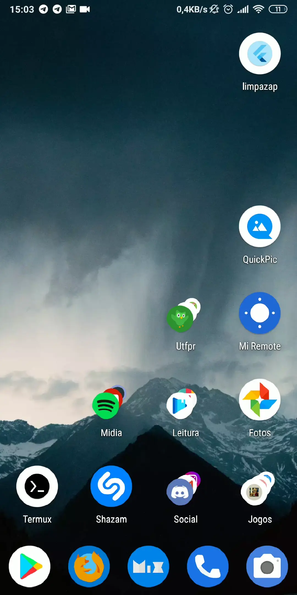

  

  
   
  

Para quem não sabe, o WhatsApp necessita fazer backup das conversas por que não trabalha baseado em núvem, como o Telegram ou o Messenger, porém, ao invés de só manter o último ele mantém o ultimo e até 7 backups anteriores a este. Por que? Eu não sei. Quando eu fico sem espaço a primeira coisa que eu faço é apagar esses backups antigos e é para isso que esse aplicativo serve.

As letras grandes foram um feedback recebido por potenciais usuários que já não tem uma visão tão boa.

# TODO
- [ ] Mandar para a PlayStore
