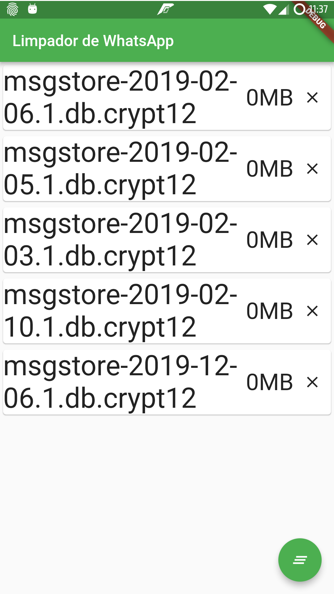

# Limpador de WhatsApp

Para quem não sabe, o WhatsApp necessita fazer backup das conversas por que não trabalha baseado em núvem, como o Telegram ou o Messenger, porém, ao invés de só manter o último ele mantém o ultimo e até 7 backups anteriores a este. Por que? Eu não sei. Quando eu fico sem espaço a primeira coisa que eu faço é apagar esses backups antigos e é para isso que esse aplicativo serve.

As letras grandes foram um feedback recebido por potenciais usuários que já não tem uma visão tão boa.

A operação é bem simples: O usuário pode escolher um dos arquivos individualmente e clicar no X para apagar, ou, apertar o botãozinho e apagar tudo de uma vez.

# TODO
- [ ] Logo
- [ ] Mandar para a PlayStore
